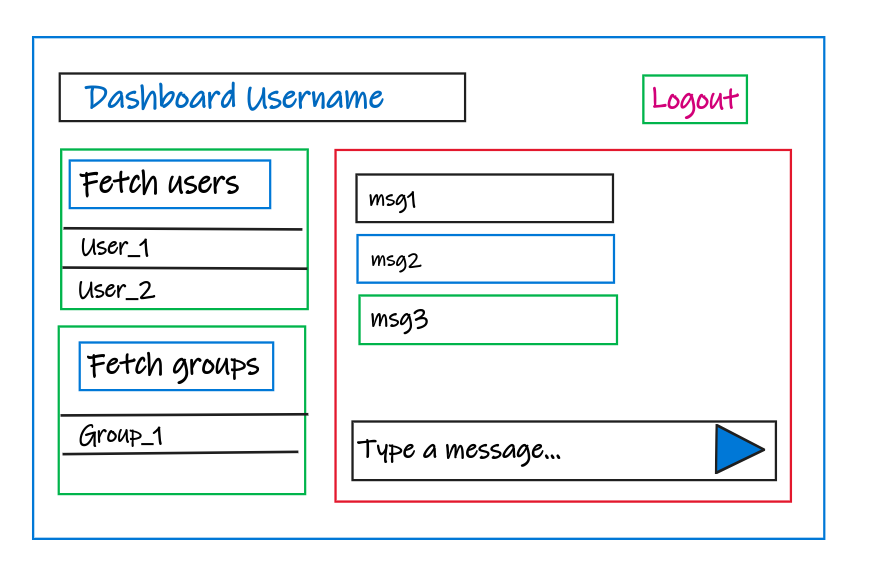

# Distributed-storage-schema-for-messaging-application
DS Project
-----------------------------------------

users_data = {
	"user_id" : {
					"cid":
					"user_list":
					"group_list":
					"msg_list": {
									"user2":[]
									"user3":[]
								}
				},

	"user_id" : {
					"cid":
					"user_list":
					"group_list":
					"msg_list": {
									"user2":[]
									"user3":[]
								}
				},

	"user_id" : {
					"cid":
					"user_list":
					"group_list":
					"msg_list": {
									"user2":[]
									"user3":[]
								}
				}
}

user1 - user2 ack loadbalancer  --> user2

loadbalancer ack to user1
topic: user1
{
	ack = 1
	msg_id
	time_stamp
	text
	uid1 = user1
	uid2 = user2
}

loadbalancer user2 msg to user1
topic: user1
{
	ack = 0
	msg_id
	time_stamp
	text
	uid1 = user2
	uid2 = user1
}

