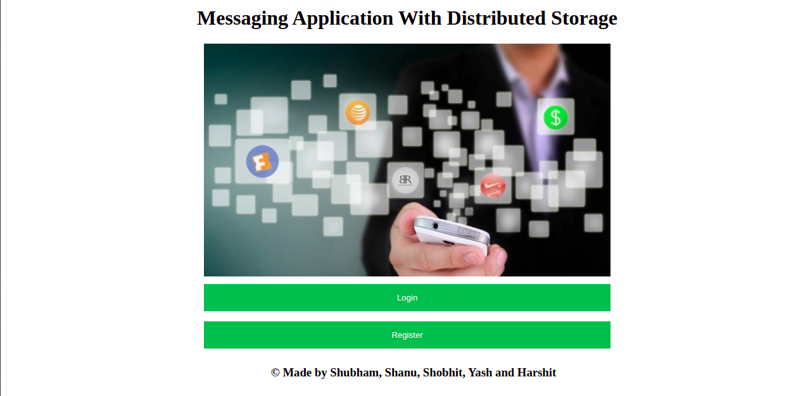
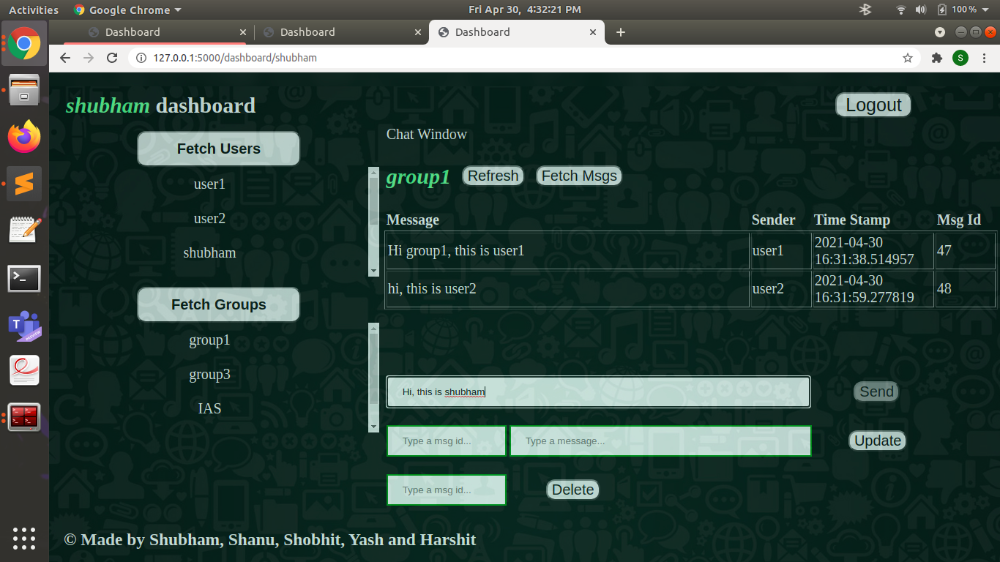
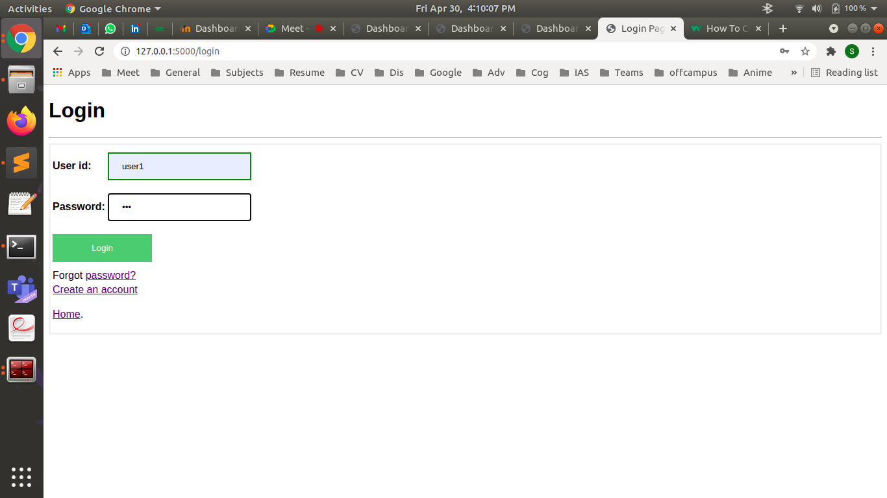
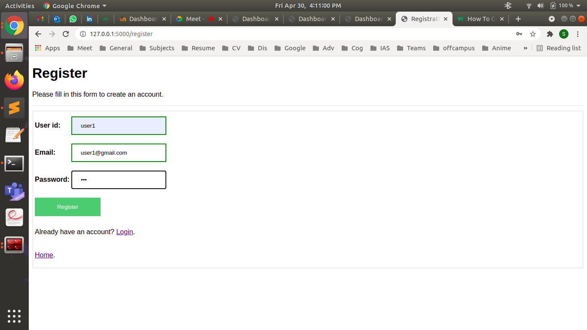

# Distributed-storage-schema-for-messaging-application
Distributed Systems, Spring 2021
-----------------------------------------

We have made this project in the Distributed Systems course in Spring 2021. Our project’s aim is to make a messaging application which supports group chats, updating and deleting messages with larger scope of scaling it to a high number of users thus the scope of scalability.

## Objective
A distributed storage schema for messaging application:
1. Should support group chat
2. Deleting/ Updating messages
3. Scalable

## Video Link:
https://drive.google.com/file/d/1qQe7kUbTAg47ecE6AOms-Nn_rA4FGoMK/view?usp=sharing

Initially thought to build this dashboard:

Finally made this:

